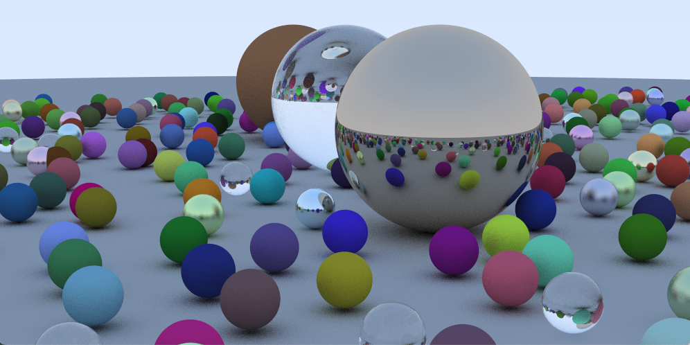
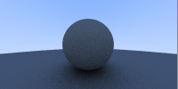

# RayTracing
## Overview
A demo for brute-forcced RayTracing, written in raw C-Language styled way, with lambertian, glass, metal material and MSAA implemented 
This random scene shows all the feature together and the material and positions of the balls are randomly generated

## Features
### Diffuse
This is the image with Lambertian Diffuse implemented

