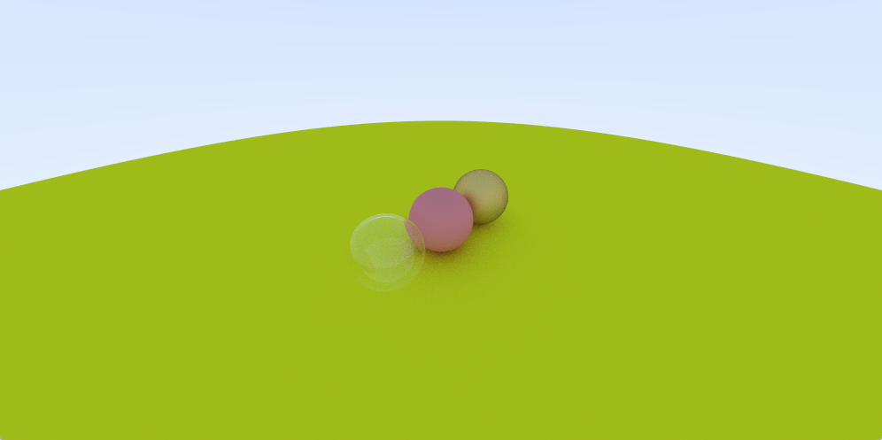

# RayTracing
## Overview
A demo for brute-forcced RayTracing, written in raw C-Language styled way, with lambertian, glass, metal material and MSAA implemented 
This random scene shows all the feature together and the material and positions of the balls are randomly generated


There is also another GPU version of ray tracer based on DirectX12 Ray Tracing and Unity, which speeds up the rendering process compared with the brute-forced CPU ray tracer mentioned above. The picture below is the conrnel box rendered based on this method.

/CornellBox.png)

## Features
### Material
#### Diffuse
This is the image with Lambertian Diffuse material implemented. 


This is implemented using the hit normal added with a random direction vector in unit sphere
```cpp
class lambertian : public material{
public:
    lambertian(const vec3&a) : albedo(a) {}
    virtual bool scatter(const ray& r_in,const hit_record& rec, vec3& attenuation, ray& scattered) const override{
        vec3 target = rec.p + rec.normal + random_in_unit_sphere();
        scattered = ray(rec.p,target-rec.p);
        attenuation = albedo;
        return  true;
    }
    vec3 albedo;
};

```
#### Metal
This image is the Metal material based on reflection with the parameter of fuzz,if fuzz = 0 it is completely a smooth surface.

 When fuzz = 1, this will lead to some roughness on the surface of the sphere 

And the metal material is implemented by the following code
```cpp
class metal : public material{
public:
    metal(const vec3&a,float f): albedo(a) {if(f < 1) fuzz = f; else fuzz = 1;}
    virtual bool scatter(const ray& r_in,const hit_record& rec, vec3& attenuation, ray& scattered)const override{
        vec3 reflected = reflect(unit_vector(r_in.direction()),rec.normal);
        scattered = ray(rec.p,reflected + fuzz * random_in_unit_sphere());
        attenuation = albedo;
        return (dot(scattered.direction(),rec.normal)>0);
    }
    vec3 albedo;
    float fuzz;
};
```
##### Reflection
The relfected ray is computed using the following method(Explanantion on the picture below and also seen in the code behind)

```cpp
vec3 reflect(const vec3& v, const vec3& n){
    return v - 2* dot(v,n)*n;
}
```
##### Fuzz
In general the fuzz term controlls the surface roughness of the material. It basically controlls the reflection direction of the rays with a little bias added on the reflection direction of the ray. This is done by generating a random point in the sphere to adjust the reflection ray directions.  

```cpp
scattered = ray(rec.p,reflected + fuzz * random_in_unit_sphere());
```
### Glass
Glass is such a special material that when the light hit the surface, it splits into a reflected ray and a refracted ray.This is implemented through randomly choosing between reflection or refraction then generating just one scattered ray every iteration. The picture below shows the  glass ball based on this method.

#### Refraction
According to the Snell's law the refraction is defined by the following equation(seen in the picture below)


And one thing worth mentioning is that when the ray is in some kind of material with higher refractive index and this will lead to no real number solution according to Snell's law. This is called total internal reflection, e.g the light inside water can not go through the surfaces and into the air.Thus the way to compute refraction is more complicated than reflection. The image and code below illustrates how this would be computed.  


```cpp
vec3 refract(const vec3& uv, const vec3& n, double etai_over_etat) 
{
    auto cos_theta = fmin(dot(-uv, n), 1.0);
    vec3 r_out_perp =  etai_over_etat * (uv + cos_theta*n);
    vec3 r_out_parallel = -sqrt(fabs(1.0 - r_out_perp.length_squared())) * n;
    return r_out_perp + r_out_parallel;
}
```
#### Schlick Approximation
In real world life, glass is view dependent. This is to say, if we look at the window at a steep angle and it will become a mirror. The origin equation for this effect is too complicated, so there is another simpler and widely-used version for that, which is a simple polynomial approximation by Christopher Schlick

```cpp
static float reflectance(double cosine, double ref_idx) {
        auto r0 = (1-ref_idx) / (1+ref_idx);
        r0 = r0*r0;
        return r0 + (1-r0)*pow((1 - cosine),5);
    }
```
#### Full Glass Code
With Schlick Approximation, the full glass material code is as below:
```cpp
    class glass : public material {
public:
    glass(double index_of_refraction) : ir(index_of_refraction) {}

    virtual bool scatter(
            const ray& r_in, const hit_record& rec, vec3& attenuation, ray& scattered
    ) const override {

        attenuation = vec3(1.0, 1.0, 1.0);
        vec3 outward_normal;
        float refraction_ratio;
        double cos_theta;
        float reflect_prob;
        vec3 unit_direction = unit_vector(r_in.direction());
        cos_theta = fmin(dot(-unit_direction, rec.normal), 1.0);
        double sin_theta = sqrt(1.0 - cos_theta*cos_theta);
        bool can_reflect = refraction_ratio * sin_theta > 1.0f;
        if(dot(r_in.direction(),rec.normal) > 0){
            outward_normal = -rec.normal;
            refraction_ratio = ir;//出射光的cos theta
            cos_theta = ir * dot(unit_direction,rec.normal);
        }
        else{
            outward_normal = rec.normal;
            refraction_ratio = 1.0 / ir;

        }
       // double refraction_ratio = rec.front_face ? (1.0/ir) : ir;

        vec3 direction;
        if(can_reflect){
            reflect_prob = 1.0f;
        }
        else{
            reflect_prob = reflectance(cos_theta,refraction_ratio);
        }
        if(drand48() < reflect_prob){
            direction = reflect(unit_direction,rec.normal);
        }
        else{
            direction = refract(unit_direction, outward_normal, refraction_ratio);
        }
        scattered = ray(rec.p, direction);
        return true;
    }

public:
    double ir; // Index of Refraction
private:
    static float reflectance(double cosine, double ref_idx) {
        auto r0 = (1-ref_idx) / (1+ref_idx);
        r0 = r0*r0;
        return r0 + (1-r0)*pow((1 - cosine),5);
    }
};
```
#### ColorBug
There is one thing worth mentioning in the glass material full code that the attenuation is always 1, which means the surface absorbs nothing. 
```cpp
virtual bool scatter(
            const ray& r_in, const hit_record& rec, vec3& attenuation, ray& scattered
    ) const override {

        attenuation = vec3(1.0, 1.0, 1.0);
```
If we change the attenuation = vec3(1.0, 1.0, 0); or to say, kill the blue channel, this will lead to an interesting color bug. The bug result shows in the picture below:


#### Hollow Glass Ball

One interesting thing to mention about the implementation of this hollow glass ball is that if the radius of the glass ball turns into negative, the geometry of the ball is unchanged due to the r^2 term, but the surface normal would be inverted to point inward. So the hollow glass ball is made up with a bigger ball with glass material and positive radius and a smaller ball with the same material but the radius is negative. The result can be seen in the following picture.


And this trick is done by the following code
``` cpp
list[3] = new sphere(vec3(-1,0,-1),0.5f, new glass(1.5f));
list[4] = new sphere(vec3(-1,0,-1),-0.45f, new glass(1.5f));

```
### Moveable Camera
A camera with an adjustable field of view and its positions is also implemented.


The fordward direction of camera is defined by axis -w (seen in the picture above), and a vector which defines the up direction is defined as well.The we could build the camera coordinate by cross product. The angle theta above implies the fov value and h = tan(theta/2) * length(foraward vector). Since we define the magnitude of forward vector equal with 1. That is to say, we keep the rays coming from the origin and pointing towards plane z = -1 which shows in the picture below.


Thus we could set up the camera coordinante by the following code
```cpp
camera(vec3 lookfrom, vec3 lookat, vec3 vup, float vfov,float aspectratio ){
        vec3 u,v,w;
        w = unit_vector(lookfrom - lookat);
        u = unit_vector(cross(vup,w));
        v = cross(w,u);
    }
```
Then we shoud change the screen space into the world's space, suppose that we have a point P(x,y) in the screen space (seen in the picture below)


We can easily get the ray from the camera origin, pointing at P in the screen and then transmitting through the entire scene by the following code

```cpp
ray get_ray(float u, float v){ return ray(origin,lower_left_corner + u * horizontal + v*vertical - origin);}

```
A scene with three spheres with diffuse metal and glass material is set up with the default camera setting


If we move the camera and change its fov in this code 
```cpp
camera cam(vec3(-2,2,1),vec3(0,0,-1),vec3(0,1,0),90,float(nx)/float(ny));
```
Then we shall get this picture 


If we change its fov value to 20 then the following change will happen


## Discussion about the extention of the code in the future
This project will implement phonton mapping in the future
